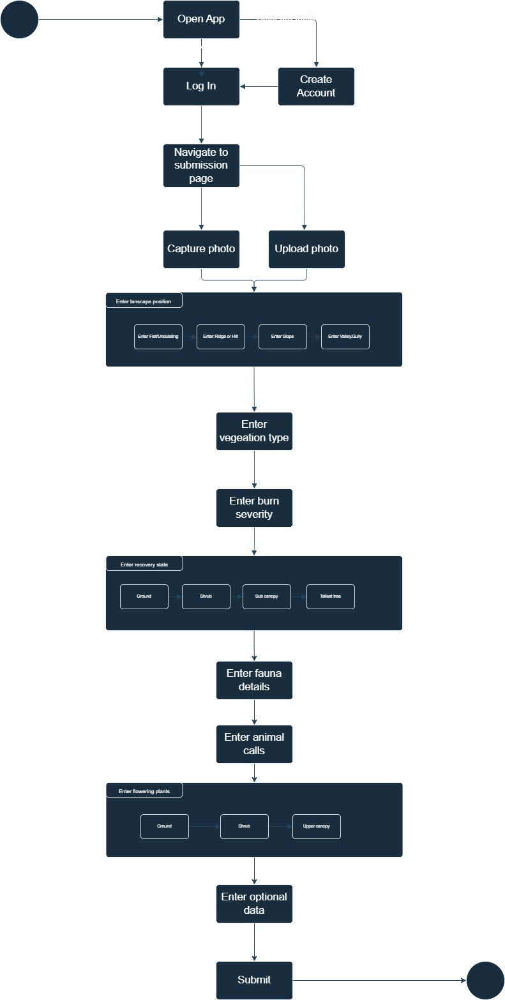

# Executive Summary

### Potential prototypes

1.  UI/UX -

- Login page
- Homepage
- Image upload / metadata page

2. Database design

- Entitiy modelling for two user types (Admin/Researcher & User/Citizen scientist)
- Database design for storing images and metadata
- Maybe some basic ACLs on admin / user func

3. Simple functionality

- Handle user login
- Build a simple prototype that allows users to upload images and metadata
- Basic API for CRUD operations on images and metadata

UI/UX can be done in figma or something simialar backend will be dotnet core and database will be postgresql - For basic prototyping can use Typescript/React with a mobile design focus

Current Kanban board : https://trello.com/b/NmcAvTbi/forest-tasks

### Project Stakeholders:

- Project Team: Developers, designers, and project manager.
- Citizen Scientists: Users of the app who will collect and submit data.
- Environmental Scientists: Experts who will analyze the collected data.
- End-Users: Those interested in monitoring forest health and post-fire recovery.

### Prototype Objectives:

- Develop a prototype of a portion of the citizen science app.
- Implement a secure login functionality.
- Enable data collection of various environmental parameters.
- Capture wildlife observations.
- Create a user-friendly interface web with a mobile focused desgin

### Work Breakdown Structure (WBS):

1. Project Initiation
   - Define project scope and objectives.
   - Identify stakeholders.
   - Form project team.
2. Requirements Gathering
   - Gather functional and non-functional requirements.
   - Define user stories and use cases.
   - Create tickets and backlog on trello
   - Identify prototypes to be developed.
3. System Design
   - Design the database schema in PostgreSQL.
   - Create the EF models in .NET.
   - Design the frontend UI using React.
   - Define the API endpoints in .NET.
4. Development
   - Implement user authentication (login functionality).
   - Create data collection forms for environmental parameters.
   - Implement wildlife observation forms.
5. Integration
   - Integrate the frontend and backend components.
   - Ensure data synchronization and validation.
6. Testing
   - Conduct unit testing and integration testing.
   - Perform user acceptance testing (UAT).
7. Documentation
   - Create user manual.
   - Create developer documentation.
   - Create project report.

### Project Dependencies and PDM:

1. Requirements Gathering (2) depends on Project Initiation (1).
2. System Design (3) depends on Requirements Gathering (2).
3. Development (4) depends on System Design (3).
4. Integration (5) depends on Development (4).
5. Testing (6) depends on Integration (5) and Development (4).
6. Documentation (7) can start in parallel with Development (4) and Integration (5).

## FURPS:

### Functionality:

1. As a Citizen Scientist, I want to create a user account and log in securely to the app so that my data remains private.

2. As a Citizen Scientist, I want to input data about the landscape position, including flat/undulating, ridge or hill, slope, and valley/gully.

3. As a Citizen Scientist, I want to select the vegetation type and its development stage, including Eucalypt forest (fern or herb), Eucalypt forest (grassy), Eucalypt forest (shrubby), Rainforest, and Riparian, and their respective stages (old, mature, regrowth, mixed, few trees present).

4. As a Citizen Scientist, I want to record the burn severity and recovery stage of flora, including severity (unburnt, low, moderate, high, extreme) and various recovery stages for ground layer, shrub layer, sub-canopy layer, and tallest tree layer.

5. As a Citizen Scientist, I want to document the species name or animal type of any fauna noticed during the survey.

6. As a Citizen Scientist, I want to record bird or animal calls in the survey location.

7. As a Citizen Scientist, I want to note the state of any flowering plants in the ground layer, shrub layer, and upper canopy layer.

8. As a Citizen Scientist, I want the option to capture altitude and barometric pressure.

9. As a Citizen Scientist, I want the option to record compass direction and accelerometer data.

### Usability:

10. As a Citizen Scientist, I want the user interface to be user-friendly, with a mobile-focused design, so that it's easy to use in the field.

### Reliability:

11. As a Citizen Scientist, I want the app to reliably store and save the data I input, even if I lose network connectivity temporarily.

###

Performance: 12. As a Project Team member, I want the app to perform efficiently, allowing quick data entry and retrieval.

### Supportability:

13. As a Project Manager, I want the app to be maintainable, with the ability to receive updates and bug fixes easily.

## Use Case:

### Use Case: Record Environmental Data

Description:

Actor: Citizen Scientist
Preconditions: Citizen Scientist is logged into the app and is in the data collection mode.
Main Flow:
Citizen Scientist selects the "Record Environmental Data" use case from the app's main menu.
The app displays a form with fields to input landscape position, vegetation type, burn severity, flora recovery, fauna observations, and more.
Citizen Scientist fills in the relevant data fields and submits the form.
The app validates and stores the data in a secure database.
Postconditions: The recorded environmental data is saved and can be accessed for analysis by Environmental Scientists or viewing by End-Users.
Alternate Flow 1: If the app detects any missing or invalid data, it prompts the Citizen Scientist to correct the errors before submission.
Alternate Flow 2: If the Citizen Scientist loses network connectivity during data entry, the app stores the data locally and syncs it with the server once connectivity is restored.

### State Diagram



## Activity Diagram Description:

### Start: The diagram begins with the "Start" activity.

### Login: The Environmental Scientist starts by logging into the app with their credentials.

### Access Location Information:

The Environmental Scientist accesses location information to view survey data.
This includes landscape position, vegetation type, burn severity, and more.
Flag Area for Review:

The Environmental Scientist has the option to flag an area if they suspect a recent bushfire.
If a bushfire is suspected, the area is flagged for further review.
Review Data:

The Environmental Scientist reviews the collected data for accuracy and relevance.
If any data or photos are incorrect or unclear, they have the option to reject or place them in a separate file for further investigation.
Perform Backend Operations:

### Performs backend operations on the database to:

Review flagged areas and investigate bushfire reports.
Validate and verify survey data for research purposes.
Manage rejected or unclear photos and data.
End: The diagram concludes with the "End" activity.

### Test plan

Front end will be tested using React-Testing-Library and jest as they give the ability to mock certain API calls allowing for flexible prototype testing in lieu of real API calls and Postgres data. The tests themselves will be considered unit tests and can be run from this repositry by doing the following:

```
Navigate to the PrototypeBase/ForestHealthPlatform/clientapp directory
Run NPM install or Yarn to install the project dependencies

Run yarn test / npx test

Wait for test output
```

All test files can be found within the test directory of this repository - for the purposes of the prototype communication with a database was not included JS objects containing mocked data were used instead.

Following the practise of equivalence partitioning the login was tested in 3 cases - rendering, valid. As no constraints exist on the size of inputs it was not tested.

GQM:

1. ### Goal: Improve Code Quality

Question: How many code defects are identified and resolved during development?
Metric: Defect Density (Defects per KLOC - Thousand Lines of Code)
Justification: Defect density is a well-established metric for assessing code quality. A lower defect density indicates higher quality code. It is reliable as it focuses on actual code issues that impact software quality.
Data Collection: Track defects using a bug tracking system, categorize them by severity, and calculate defect density for each release.

2. ### Goal: Enhance Development Productivity

Question: What is the average time taken to complete a user story or feature?
Metric: Cycle Time (Average time from task assignment to completion)
Justification: Cycle time measures how quickly tasks are completed, reflecting development team productivity. It's reliable as it directly relates to project efficiency.
Data Collection: Record the start and end times for each task or user story in a project management tool and calculate the average cycle time.

3. ### Goal: Ensure Timely Delivery

Question: How often do project milestones meet their planned deadlines?
Metric: Milestone On-time Delivery Rate (Percentage of milestones met on time)
Justification: Timely delivery is crucial. This metric's validity is evident in its alignment with project scheduling goals.
Data Collection: Maintain a project schedule with milestones and deadlines. Regularly assess and update the status of each milestone to determine if it was delivered on time.

4. ### Goal: Enhance Collaboration

Question: Are team members actively participating in collaborative activities?
Metric: Collaboration Index (Number of contributions to collaborative tools like version control or documentation repositories)
Justification: Collaboration is vital for project success. The metric measures team engagement and the reliability comes from tracking specific actions.
Data Collection: Monitor contributions made by team members to shared repositories using version control systems or documentation platforms.

5. ### Goal: Improve Code Maintainability

Question: How often is code refactored to improve maintainability?
Metric: Code Refactoring Frequency (Number of refactorings per sprint)
Justification: Code maintainability is critical for long-term sustainability. The metric assesses proactive maintenance efforts.
Data Collection: Track the number of code refactorings performed during each sprint or development cycle.
To ensure the validity and reliability of these metrics, it's essential to define clear measurement definitions, standardize data collection processes, and regularly review and refine the metrics based on feedback and evolving project goals. Additionally, validation can be done through comparison with industry benchmarks or historical project data. Reliable and consistent data collection tools and practices are key to obtaining meaningful insights from these metrics and using them effectively to drive project improvements.
